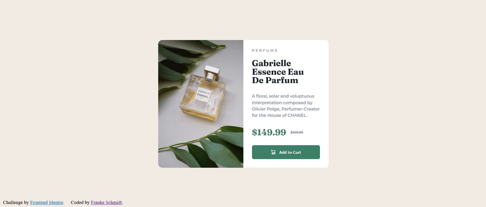

# Frontend Mentor - QR code component solution

This is a solution to the [Product preview card component challenge on Frontend Mentor](https://www.frontendmentor.io/challenges/product-preview-card-component-GO7UmttRfa). Frontend Mentor challenges help you improve your coding skills by building realistic projects. 

## Table of contents

  - [Overview](#overview)
  - [Screenshot](#screenshot)
  - [Links](#links)
  - [My process](#my-process)
  - [Built with](#built-with)
  - [What I learned](#what-i-learned)
  - [Continued development](#continued-development)
  - [Useful resources](#useful-resources)
  - [Author](#author)

## Overview

My 4th challenge for front end developers.

### Screenshot

 and 

### Links

- Solution URL: [https://github.com/colognia/product-preview-card-component-main.git]
- Live Site URL: [https://https://colognia.github.io/product-preview-card-component-main/]

## My process

- build html
- create css
- check and verify frequently with Firefox and its developer console
- consulting my own notes regarding usage of tags/options, consulting developers.mozilla.org and w3schools

### Built with

- Semantic HTML5 markup
- CSS custom properties
- editor: visual studio code

### What I learned
More about grids and positioning items inside. To exchange pictures thru display: none/unset; was my way to exchange pictures for different screen sizes.

### Continued development
Learn more about grids and media queries.
I am unsure about sizing of maincontainer, because we do not have values. Relative units do not work, because screen width changes and you want some respnsove margin.

### Useful resources

developers.mozilla.org
w3schools

## Author

- Frontend Mentor - [@colognia] (https://www.frontendmentor.io/profile/colognia)
- Linkedin - (https://www.linkedin.com/in/frauke-s-395242201/)

